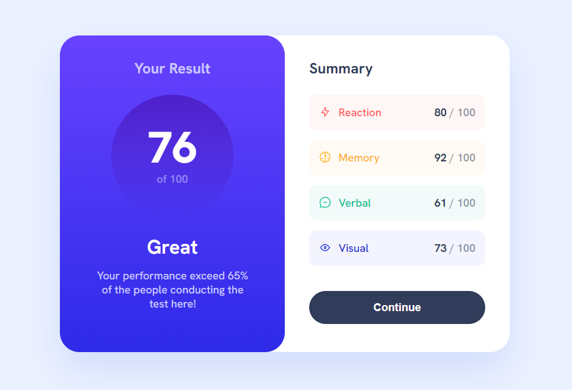
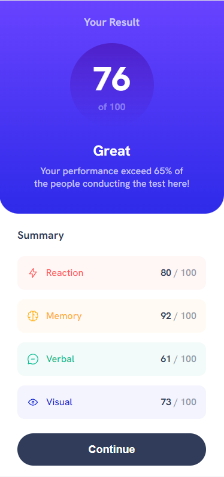

# Frontend Mentor - Results summary component solution

This is a solution to the [Results summary component challenge on Frontend Mentor](https://www.frontendmentor.io/challenges/results-summary-component-CE_K6s0maV).

## Table of contents

- [Overview](#overview)
  - [The challenge](#the-challenge)
  - [Screenshot](#screenshot)
  - [Links](#links)
- [My process](#my-process)
  - [Built with](#built-with)
- [Author](#author)

## Overview

### The challenge

Users should be able to:

- View the optimal layout for the interface depending on their device's screen size
- See hover and focus states for all interactive elements on the page

### Screenshot

### Links

- Solution URL: [GitHub Repository](https://github.com/danieldiogenes/results-summary-component)
- Live Site URL: [result-summary-component](https://danieldiogenes.github.io/results-summary-component/)

## My process

### Built with

- Semantic HTML5 markup
- CSS custom properties
- Flexbox
- CSS Grid
- Mobile-first workflow

### What I've learned

In this project I was able to exercise the use of flexbox and css grid, despite being a simple resolution application and that could be done more quickly using some library like tailwind or bootstrap, I decided to opt for a more "pure" solution using simple css.

To organize the css classes I used the BEM methodology, it is easier to understand the code when it is done using pure css, which is the pattern I intend to follow in this type of solution, I also used variables to simplify the code of the css classes and make it easier some change. I chose not to apply javascript or leave the page with dynamic data, I intend to make the project more complete in the future.

## Author

- Frontend Mentor - [@danieldiogenes](https://www.frontendmentor.io/profile/danieldiogenes)
